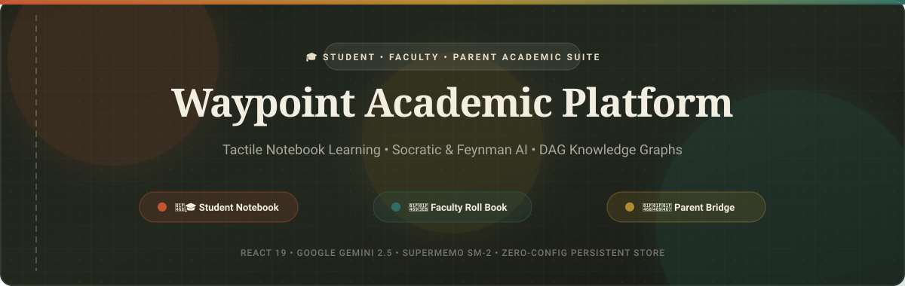
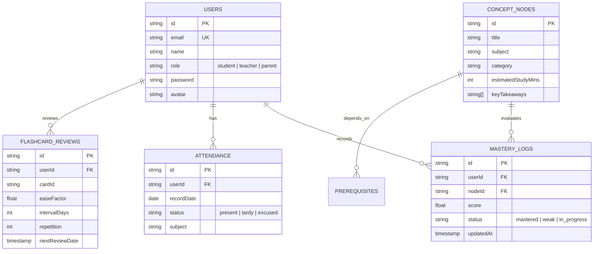

<!-- ========================================================= -->
<!-- 1. BANNER -->
<!-- ========================================================= -->

```
========================================================================================
                                WAYPOINT ACADEMIC SUITE
                   University Student • Faculty • Administration Portal
========================================================================================
```

<p align="center">
  
</p>

<!-- ========================================================= -->
<!-- 2. TITLE -->
<!-- ========================================================= -->

# 🎓 Waypoint — University Student & Faculty Portal

> **A modern, intelligent academic portal that digitizes university operations, cognitive learning, and curriculum mastery for students, faculty, and administrators.**

---

<!-- ========================================================= -->
<!-- 3. BADGES -->
<!-- ========================================================= -->

<p align="center">
  <a href="https://react.dev/"></a>
  <a href="https://www.typescriptlang.org/"></a>
  <a href="https://vitejs.dev/"></a>
  <a href="https://supabase.com/"></a>
  <a href="https://vercel.com/"></a>
  <a href="LICENSE"></a>
  <a href="https://github.com/10-Mohan/edtech/pulls"></a>
</p>

---

<!-- ========================================================= -->
<!-- 4. ABOUT / DESCRIPTION -->
<!-- ========================================================= -->

## 📖 About

The **Waypoint University Student & Faculty Portal** is a full-stack academic platform designed to unify university coursework, pedagogical analytics, and autonomous cognitive learning. 

Built on tactile notebook aesthetics and grounded in cognitive learning science, Waypoint replaces outdated Learning Management Systems (LMS) with an interactive ecosystem:

- 👨‍🎓 **Students** master difficult STEM and academic concepts using interactive **Directed Acyclic Knowledge Graphs (DAGs)**, **SuperMemo SM-2 spaced repetition**, step-by-step **Socratic inquiry**, and **Feynman "Teach-Back" evaluation**.
- 👩‍🏫 **Faculty Members** orchestrate cohorts with **Live Mastery Heatmaps**, auto-generate **3-Tier Differentiated Worksheets** (Scaffolded, Standard, and Proof Extensions), and detect systemic cohort misconceptions before exams.
- 🏛️ **Administrators & Guardians** monitor academic health, track real-time attendance, enforce AI safety guardrails, and access weekly digests.

---

<!-- ========================================================= -->
<!-- 5. FEATURES -->
<!-- ========================================================= -->

## ✨ Features

### 👨‍🎓 Student Hub
- [x] **Secure Role-Based Authentication**: Strict credential verification and dedicated Student / Faculty login validation.
- [x] **Interactive Concept Graph (DAG)**: Real-time visual prerequisite tree connecting foundational topics to advanced mastery.
- [x] **SM-2 Spaced Repetition**: Dynamic interval scheduling flashcard engine with 3D flip card animations.
- [x] **Dual-Mode Socratic & Feynman AI Tutor**:
  - *Socratic Inquiry*: Step-by-step guidance without spoon-feeding answers.
  - *Feynman Technique ("Teach Me")*: Student explains concepts; AI evaluates completeness, misconceptions, and clarity.
- [x] **Multi-Step AI Homework Scanner**: Optical derivation parser that isolates the exact mathematical step where an error occurred.
- [x] **Adaptive Diagnostic Assessment**: Identifies conceptual gaps and auto-generates personalized remediation decks.
- [x] **Engineering Career Roadmaps**: "Why am I learning this?" real-world bridges connecting curriculum to careers (Robotics, Game Physics, Bio-computation).
- [x] **Attendance & Comprehensive Gradebook**: Real-time attendance percentage, period-by-period logs, and term scores.

### 👩‍🏫 Faculty Roll Book
- [x] **Classroom Mastery Heatmap**: Real-time matrix view of individual and cohort understanding across all curriculum nodes.
- [x] **3-Tier Differentiated Worksheet Studio**: 1-click generation of Scaffolded (Tier 1), Standard (Tier 2), and Proof/Extension (Tier 3) assignments with print-ready layouts.
- [x] **Cohort Misconception Radar**: Groups students struggling with identical blockers for targeted small-group intervention.
- [x] **Curriculum Node Authoring Studio**: Create, edit, and reorganize concept nodes, prerequisites, and key takeaways.
- [x] **Live Attendance Roster**: Instant presence, absence, and tardy logging.
- [x] **At-Risk Student Intervention Alerts**: Automatic flagging of students facing prerequisite chain collapse.

### 🏛️ Admin & Governance
- [x] **Multi-Tenant User Management**: Unified role access control across Students, Teachers, and Parents.
- [x] **AI Safety & Governance Monitor**: Real-time prompt injection detection, answer-leak prevention, and hallucination scoring.
- [x] **Hybrid Postgres Cloud & Offline Cache**: Instant sync with Supabase PostgreSQL and reliable offline fallback.
- [x] **Comprehensive Academic Analytics**: Cohort progression rate, daily active study time, and recall retention curves.

---

<!-- ========================================================= -->
<!-- 6. SCREENSHOTS -->
<!-- ========================================================= -->

## 📷 Interface Previews

| 🔐 **Notebook Authentication** | 🧭 **Student Knowledge Graph** |
|:---:|:---:|
|  |  |
| *Strict credential check & tactile open-notebook UI* | *Interactive DAG prerequisite nodes & mastery scoring* |

| 👩‍🏫 **Faculty Mastery Heatmap** | 📝 **Differentiated Worksheet Studio** |
|:---:|:---:|
|  |  |
| *Real-time cohort matrix & misconception radar* | *3-Tiered automated assignment generator (Scaffolded to Proof)* |

| 🤖 **Feynman "Teach-Back" AI** | 📊 **Attendance & Gradebook** |
|:---:|:---:|
|  |  |
| *Cognitive evaluation of student-explained concepts* | *Student academic breakdown, logs, and parent reports* |

---

<!-- ========================================================= -->
<!-- 7. DEMO -->
<!-- ========================================================= -->

## 🎥 Demo & Quick Access

Try out the live demonstration accounts directly on the platform:

| Role | Email | Password |
|:---|:---|:---|
| 👨‍🎓 **Student** | `maya.lin@student.waypoint.edu` | `demo123` |
| 👩‍🏫 **Faculty** | `dr.vance@faculty.waypoint.edu` | `demo123` |
| 👨‍👩‍👧 **Parent** | `elena.lin@parent.waypoint.edu` | `demo123` |

> 💡 *Or click **"Register new account"** on the login page to create your own custom profile with custom credentials.*

---

<!-- ========================================================= -->
<!-- 8. TECH STACK -->
<!-- ========================================================= -->

## 🚀 Tech Stack

### Frontend
- ⚛️ **React 19** — Next-generation component architecture
- 🟦 **TypeScript 5.7** — Strict end-to-end type safety
- ⚡ **Vite 6** — Ultra-fast HMR and optimized bundler
- 🎨 **Notebook Design System** — Custom CSS variables with light/dark/tactile themes
- 🔣 **Lucide React** — Modern, lightweight iconography
- 📊 **Canvas Confetti & SVG DAG Renderers** — Interactive graph and milestone animations

### Backend & Serverless
- 🌐 **Vercel Serverless Functions** (`/api/chat`, `/api/vision`, `/api/vector`, `/api/health`)
- 🛡️ **Edge Middleware** — Per-user rate limiting, CORS headers, and payload validation

### Database & Vector Storage
- 🐘 **Supabase (PostgreSQL)** — Relational tables for Users, Nodes, Attendance, and Mastery Logs
- 🔍 **Qdrant Vector Database** — Semantic similarity search for concept embeddings
- 💾 **Resilient Local Storage Layer** — Instant zero-latency offline operation

### AI & Cognitive Engines
- 🧠 **Google Gemini 2.5 (Flash & Pro)** — Dual-mode Socratic dialogue and multimodal vision reasoning
- 📈 **SuperMemo SM-2 Algorithm** — Spaced repetition active recall scheduling

---

<!-- ========================================================= -->
<!-- 9. ARCHITECTURE -->
<!-- ========================================================= -->

## 🏛️ System Architecture

```mermaid
flowchart TD
    subgraph Client["Client Tier (React 19 + TypeScript)"]
        UI[Tactile Notebook UI]
        KG[Interactive DAG Graph]
        FEYN[Socratic & Feynman Tutor]
        TEACH[Faculty Roll Book & Studio]
    end

    subgraph API["Edge & Serverless Tier (Vercel)"]
        ROUTER[/api Gateway Router]
        CHAT_EP[/api/chat - Socratic AI]
        VISION_EP[/api/vision - Homework OCR]
        VECTOR_EP[/api/vector - Concept Search]
        HEALTH_EP[/api/health - Diagnostics]
    end

    subgraph AI["Cognitive & AI Services"]
        GEMINI[Google Gemini 2.5 LLM]
        SM2[SuperMemo SM-2 Engine]
    end

    subgraph Data["Database & Storage Tier"]
        SUPA[(Supabase PostgreSQL)]
        QDRANT[(Qdrant Vector Store)]
        CACHE[(Local Storage Cache)]
    end

    UI --> ROUTER
    KG --> ROUTER
    FEYN --> CHAT_EP
    TEACH --> ROUTER

    CHAT_EP --> GEMINI
    VISION_EP --> GEMINI
    VECTOR_EP --> QDRANT
    ROUTER --> SUPA
    UI <--> CACHE
```

---

<!-- ========================================================= -->
<!-- 10. FOLDER STRUCTURE -->
<!-- ========================================================= -->

## 📁 Repository Structure

```
edtech/
├── 📁 api/                        # Serverless Edge backend endpoints
│   ├── chat.ts                   # Socratic & Feynman AI dialogue handler
│   ├── health.ts                 # Real-time service uptime & diagnostic check
│   ├── vector.ts                 # Qdrant vector semantic search
│   └── vision.ts                 # Multimodal homework derivation scanner
├── 📁 assets/                     # High-DPI banners, SVGs, and graphics
│   └── banner.svg
├── 📁 public/                     # Static web assets & icons
├── 📁 src/                        # Core React frontend application
│   ├── 📁 components/
│   │   ├── 📁 auth/              # LoginPage, RegisterModal, role validation
│   │   ├── 📁 common/            # Header, Navigation, Modals, ThemeSelectors
│   │   ├── 📁 parent/            # ParentDashboard, Weekly Digests, Reports
│   │   ├── 📁 student/           # KnowledgeGraph, Flashcards, FeynmanTutor, HomeworkScanner
│   │   └── 📁 teacher/           # TeacherDashboard, MasteryHeatmap, WorksheetStudio
│   ├── 📁 data/                  # Pre-seeded concept graph & demo users
│   │   └── mockData.ts
│   ├── 📁 services/              # Business logic & API communication
│   │   ├── aiService.ts          # Gemini orchestration & fallback handling
│   │   ├── backendService.ts     # User authentication, nodes, & sync
│   │   ├── storageService.ts     # SM-2 cards, preferences, & metrics
│   │   ├── supabaseService.ts    # PostgreSQL cloud connector
│   │   └── vectorDbService.ts    # Qdrant semantic indexing
│   ├── 📁 types/                 # TypeScript interfaces and domain models
│   │   └── index.ts
│   ├── App.tsx                   # Top-level state orchestration & routing
│   ├── main.tsx                  # React DOM mount point
│   └── index.css                 # Global notebook tokens & theme palette
├── .env.example                  # Environment variable blueprint
├── package.json                  # Dependencies and scripts
├── tsconfig.json                 # TypeScript compiler configuration
├── vercel.json                   # Serverless routing & deployment configuration
└── vite.config.ts                # Vite build configuration
```

---

<!-- ========================================================= -->
<!-- 11. INSTALLATION & SETUP -->
<!-- ========================================================= -->

## 🛠️ Installation & Setup

### Prerequisites
- **Node.js**: v18.0.0 or higher
- **npm**: v9.0.0 or higher
- **Git**

### 1. Clone the Repository
```bash
git clone https://github.com/10-Mohan/edtech.git
cd edtech
```

### 2. Install Dependencies
```bash
npm install
```

### 3. Configure Environment Variables
Copy the template and fill in your keys:
```bash
cp .env.example .env
```

### 4. Run Development Server
```bash
npm run dev
```
Open your browser at `http://localhost:5173`.

### 5. Build for Production
```bash
npm run build
npm run preview
```

---

<!-- ========================================================= -->
<!-- 12. ENVIRONMENT VARIABLES -->
<!-- ========================================================= -->

## 🔐 Environment Variables

Create a `.env` file in the root directory:

```ini
# =======================================================
# AI Gateway & LLM Orchestration
# =======================================================
VITE_GEMINI_API_KEY=your_gemini_api_key_here
GEMINI_API_KEY=your_gemini_api_key_here

# =======================================================
# Cloud Database (Supabase PostgreSQL)
# =======================================================
VITE_SUPABASE_URL=https://your-project.supabase.co
VITE_SUPABASE_ANON_KEY=your-supabase-anon-key
SUPABASE_SERVICE_ROLE_KEY=your-supabase-service-role-key

# =======================================================
# Vector Search Engine (Qdrant)
# =======================================================
VITE_QDRANT_URL=https://your-qdrant-cluster.qdrant.io
VITE_QDRANT_API_KEY=your-qdrant-api-key

# =======================================================
# Server Configuration
# =======================================================
PORT=5173
```

---

<!-- ========================================================= -->
<!-- 13. API REFERENCE -->
<!-- ========================================================= -->

## 📡 API Reference

### Edge Endpoints

| Method | Endpoint | Description | Payload Example |
|:---|:---|:---|:---|
| `POST` | `/api/chat` | Conducts Socratic or Feynman dialogue | `{ "prompt": "Explain limits", "mode": "socratic" }` |
| `POST` | `/api/vision` | Analyzes handwritten homework derivation | `{ "image": "data:image/png;base64,...", "topic": "Calculus" }` |
| `POST` | `/api/vector` | Semantic search across concept embeddings | `{ "query": "optimization derivatives", "topK": 5 }` |
| `GET` | `/api/health` | Healthcheck & provider diagnostics | *None* |

### Core TypeScript Services

| Service | Method | Purpose |
|:---|:---|:---|
| **`BackendService`** | `authenticateWithPassword(email, pass, role)` | Strict credential verification |
| **`BackendService`** | `registerUserAccount(email, name, role, code, pass)` | Registers and persists a new user |
| **`BackendService`** | `getConceptNodes()` | Retrieves active DAG nodes |
| **`StorageService`** | `updateCardReview(cardId, quality)` | Runs SM-2 active recall scheduling |
| **`SupabaseService`**| `syncClassroomMastery(studentId, metrics)` | Persists metrics to PostgreSQL |

---

<!-- ========================================================= -->
<!-- 14. DATABASE SCHEMA -->
<!-- ========================================================= -->

## 🗄️ Database Schema & Entities



---

<!-- ========================================================= -->
<!-- 15. FUTURE SCOPE -->
<!-- ========================================================= -->

## 🚀 Future Scope & Roadmap

- [ ] 📱 **Cross-Platform Mobile App**: React Native / Expo build for iOS and Android.
- [ ] 👤 **Automated Facial Recognition Attendance**: Edge camera integration for automated roll call.
- [ ] 🎙️ **Real-Time Voice Socratic AI**: Low-latency spoken conversational tutoring using WebRTC audio.
- [ ] 🔗 **LMS & Canvas LTI 1.3 Integration**: Direct Gradebook and Roster sync for universities and schools.
- [ ] 💳 **Integrated Tuition & Lab Fee Payment Gateway**: Stripe / Razorpay academic billing checkout.
- [ ] 📝 **Proctored Online Examination Engine**: Browser lockdown and AI anomaly detection for tests.

---

<!-- ========================================================= -->
<!-- 16. CONTRIBUTORS -->
<!-- ========================================================= -->

## 👨‍💻 Contributors

- **Mohan S** — Lead Developer & Architect — [@10-Mohan](https://github.com/10-Mohan)

---

<!-- ========================================================= -->
<!-- 17. LICENSE -->
<!-- ========================================================= -->

## 📄 License

This project is licensed under the **MIT License** — see the [LICENSE](LICENSE) file for details.

```
MIT License

Copyright (c) 2026 Mohan S

Permission is hereby granted, free of charge, to any person obtaining a copy
of this software and associated documentation files (the "Software"), to deal
in the Software without restriction, including without limitation the rights
to use, copy, modify, merge, publish, distribute, sublicense, and/or sell
copies of the Software, and to permit persons to whom the Software is
furnished to do so, subject to the following conditions:

The above copyright notice and this permission notice shall be included in all
copies or substantial portions of the Software.
```
