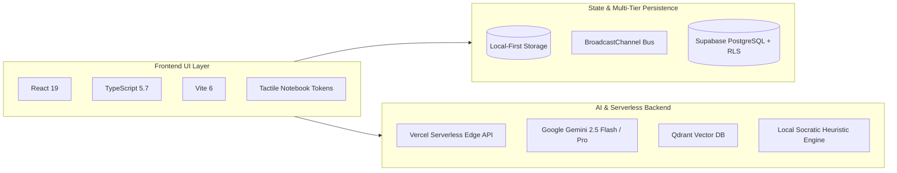

<!-- ========================================================= -->
<!-- 1. BANNER -->
<!-- ========================================================= -->

```
========================================================================================
                                WAYPOINT ACADEMIC SUITE
                   Student • Faculty • Parent Cognitive Learning Hub
========================================================================================
```

<p align="center">
  
</p>

<!-- ========================================================= -->
<!-- 2. TITLE & TAGLINE -->
<!-- ========================================================= -->

# 🎓 Waypoint — University Student & Faculty Portal

> **A tactile, cognitive learning platform that unifies academic operations, Socratic & Feynman AI tutoring, spaced repetition (SM-2), and curriculum knowledge graphs for students, educators, and families.**

<p align="center">
  <a href="https://edtech-fawn.vercel.app"></a>
  <a href="https://github.com/10-Mohan/edtech/actions/workflows/ci.yml"></a>
  <a href="https://vitest.dev/"></a>
  <a href="LICENSE"></a>
</p>

<p align="center">
  <a href="https://react.dev/"></a>
  <a href="https://www.typescriptlang.org/"></a>
  <a href="https://vitejs.dev/"></a>
  <a href="https://supabase.com/"></a>
  <a href="https://ai.google.dev/"></a>
  <a href="https://qdrant.tech/"></a>
</p>

---

<!-- ========================================================= -->
<!-- 3. LIVE DEMO & QUICK START -->
<!-- ========================================================= -->

## ⚡ Live Demo & Quick Start

### 🌐 Live Production Deployment
**Instant Evaluation**: [**https://edtech-fawn.vercel.app**](https://edtech-fawn.vercel.app)

---

### 💻 Local 60-Second Setup

```bash
# 1. Clone the repository
git clone https://github.com/10-Mohan/edtech.git

# 2. Navigate to the project directory
cd edtech

# 3. Install dependencies
npm install

# 4. (Optional) Configure environment keys (Gemini, OpenAI, Supabase, Qdrant)
cp .env.example .env

# 5. Start the development server
npm run dev
```
Open [http://localhost:5173](http://localhost:5173) in your browser.

---

### 🔑 Demo Evaluation Credentials

| Role | Email | Password | Access Highlights |
|:---|:---|:---|:---|
| 👨‍🎓 **Student** | `maya.lin@oakwood.edu` | `student123` | Interactive DAG Graph, SM-2 Flashcards, Socratic AI & Feynman Tutor |
| 👩‍🏫 **Faculty (Teacher)** | `elena.vance@oakwood.edu` | `teacher123` | Classroom Mastery Heatmap, 3-Tier Worksheet Studio, Roster Import |
| 👨‍👩‍👧 **Parent / Guardian** | `elena.lin@family.org` | `parent123` | Weekly Growth Digest, Live Attendance, Dinner Table Starters |

---

<!-- ========================================================= -->
<!-- 4. TECH STACK (FRONTEND, BACKEND, DATABASE & AI) -->
<!-- ========================================================= -->

## 🚀 Complete Tech Stack



### 1. Backend, Database & Persistence Layer
- 🐘 **Supabase PostgreSQL (`@supabase/supabase-js`)** — Relational database with Row Level Security (RLS) policies for multi-device sync, gradebooks, and collaborative teacher authoring.
- 💾 **Local-First Browser Engine (`localStorage`)** — Zero-latency offline storage with schema versioning for concept mastery, active recall intervals, and auth sessions.
- 📡 **Real-Time `BroadcastChannel` Event Bus** — Pub/Sub messaging syncing student node completions, mastery updates, and teacher interventions across open browser tabs.
- ⚡ **Vercel Serverless Edge Runtime** — TypeScript API handlers (`api/chat.ts`, `api/vision.ts`, `api/vector.ts`, `api/health.ts`).
- 🗄️ **Qdrant Vector Storage** — High-performance vector embeddings for semantic search and curriculum similarity search.

### 2. Artificial Intelligence & Cognitive Engines
- 🧠 **Google Gemini 2.5 (Flash & Pro)** — Dual-mode Socratic dialogue and multimodal homework vision reasoning.
- 🤖 **OpenAI (GPT-4o) & Anthropic (Claude 3.5)** — Proxy-ready BYOK support configured via serverless routes.
- 📉 **SuperMemo SM-2 Mathematical Algorithm** — Spaced repetition mathematical scheduling ($EF \ge 1.3$).
- 💡 **Offline Deterministic Heuristic Engine** — In-browser fallback executing structured Socratic dialogue and Feynman rubrics even without an API key.

### 3. Frontend & Presentation Layer
- ⚛️ **React 19** — Concurrent component state, hooks, and suspense boundaries.
- 🟦 **TypeScript 5.7** — Strict end-to-end type safety.
- ⚡ **Vite 6** — Instant Hot Module Replacement (HMR) and optimized rollup bundle.
- 🎨 **Notebook Design System** — Custom CSS variables with warm paper/ink palette & dark/light modes.
- 🔣 **Lucide React** — Minimalist typography and icons.
- 📊 **Canvas Confetti & SVG DAG Renderers** — Interactive graph rendering and celebration effects.

---

<!-- ========================================================= -->
<!-- 5. SYSTEM & DATA PERSISTENCE ARCHITECTURE -->
<!-- ========================================================= -->

## 🏛️ System & Persistence Architecture

### 💾 Where Does Data Live? (Data Lifecycle)

| Persistence Tier | Technology | Lifecycle & Purpose |
|:---|:---|:---|
| **Tier 1: Local-First Cache** | `localStorage` + Memory Store | Instant zero-latency offline persistence for SM-2 repetition schedules, active recall intervals, mastery logs, and user sessions. Survives page reloads and browser restarts. |
| **Tier 2: Cross-Tab Event Bus** | `BroadcastChannel` Pub/Sub | Real-time cross-tab synchronization broadcasting node completions, mastery updates, and teacher interventions across open browser tabs. |
| **Tier 3: Enterprise Cloud DB** | Supabase PostgreSQL (`@supabase/supabase-js`) | Cloud persistence with full Row Level Security (RLS) policies (`supabaseService.ts`) for multi-device sync, school gradebooks, and collaborative faculty authoring. |

---

<!-- ========================================================= -->
<!-- 6. UI ARCHITECTURE & DESIGN PREVIEWS -->
<!-- ========================================================= -->

## 🎨 UI Architecture & Design Previews

> 💡 *The vector schematics below illustrate the core interface layouts and workflow mechanics. To explore the live interactive application with active animations, Socratic tutoring, and 3D card flips, visit the **[Live Deployed App](https://edtech-fawn.vercel.app)**.*

| 🔐 **Notebook Authentication** | 🧭 **Student Knowledge Graph (DAG)** |
|:---:|:---:|
|  |  |
| *Strict credential check & tactile open-notebook layout* | *Interactive DAG prerequisite nodes & mastery scoring* |

| 👩‍🏫 **Faculty Mastery Heatmap** | 📝 **Differentiated Worksheet Studio** |
|:---:|:---:|
|  |  |
| *Real-time cohort matrix & misconception radar* | *3-Tiered automated assignment generator (Scaffolded to Proof)* |

| 🤖 **Feynman "Teach-Back" AI** | 👨‍👩‍👧 **Parent Digest & Academic Report** |
|:---:|:---:|
|  |  |
| *Cognitive evaluation of student-explained concepts* | *Plain-language weekly summary, conversation prompts & logs* |

---

<!-- ========================================================= -->
<!-- 7. AUTOMATED TESTS & CI/CD PIPELINE -->
<!-- ========================================================= -->

## 🧪 Testing, Mathematical Verification & CI/CD

Waypoint includes an automated test suite with **41 passing unit and integration tests** built on [Vitest](https://vitest.dev/).

```bash
# Run the complete test suite
npm test
```

### 📋 Test Coverage Highlights (41 / 41 Tests Passing)

| Test Suite | File | Tests | Verification Scope |
|:---|:---|:---:|:---|
| **SM-2 Algorithm Math** | `src/test/srsEngine.test.ts` | 5 | Validates SuperMemo SM-2 interval formulas, ease factor bounds ($EF \ge 1.3$), repetition resets, and overdue scheduling. |
| **AI Pedagogical Engine** | `src/test/aiEngine.test.ts` | 4 | Tests Socratic dialogue branching, Feynman rubric scoring, and response formatting. |
| **Safety & Guardrails** | `src/test/guardrailService.test.ts` | 8 | Verifies prompt injection prevention, safety heuristics, and content filtering. |
| **Backend & Auth Service** | `src/test/backendService.test.ts` | 6 | Tests credential authentication, role validation, node retrieval, and registration. |
| **PostgreSQL RLS Security** | `src/test/securityAndRateLimit.test.ts` | 6 | Validates Row Level Security schema rules and tenant isolation policies. |
| **Vector & Search Service** | `src/test/vectorService.test.ts` | 5 | Tests concept similarity scoring and semantic indexing. |
| **Curriculum Authoring** | `src/test/curriculumAuthoring.test.ts` | 3 | Tests DAG node creation, prerequisite integrity, and validation. |
| **Curriculum Generator** | `src/test/curriculumGenerator.test.ts` | 2 | Tests 3-tier worksheet generation and rubric mapping. |
| **Theme & UI Tokens** | `src/test/theme.test.ts` | 2 | Validates theme palette switching and CSS variable persistence. |

### 🚀 Continuous Integration (GitHub Actions)
Every commit and pull request triggers our automated CI pipeline ([`.github/workflows/ci.yml`](.github/workflows/ci.yml)), which executes:
1. **TypeScript Strict Typecheck** (`tsc -b`)
2. **Vitest Unit & Integration Suite** (`npm test -- --run`)
3. **Production Rollup Bundle Build** (`npm run build`)

---

<!-- ========================================================= -->
<!-- 8. ENGINEERING TIMELINE & ARCHITECTURE JOURNEY -->
<!-- ========================================================= -->

## 🛠️ Engineering Timeline & Architecture Journey

To achieve high reliability during a competitive hackathon timeline, Waypoint was developed through five focused architectural phases:

1. **Phase 1: Mathematical Foundations & DAG Domain Model**
   - Built the directed acyclic graph (DAG) topological sorting and prerequisite validation.
   - Implemented the SuperMemo SM-2 spaced repetition mathematical engine with ease-factor decay algorithms.
2. **Phase 2: Tactile Paper-and-Ink Design System**
   - Engineered custom CSS design tokens emulating physical notebook paper, margin rules, and ink palettes.
   - Constructed the Student Hub, Faculty Roll Book, and Parent Bridge portals.
3. **Phase 3: Dual-Mode Cognitive AI Gateway**
   - Integrated Google Gemini 2.5 for live multimodal homework step-by-step error detection.
   - Built the zero-dependency client heuristic engine for instant, deterministic Socratic tutoring without API key dependencies.
4. **Phase 4: Multi-Tier Persistence & Cross-Tab Real-Time Sync**
   - Implemented local-first offline storage with schema versioning.
   - Wired `BroadcastChannel` for live cross-tab updates and defined Supabase PostgreSQL schemas with Row Level Security (RLS).
5. **Phase 5: Automated Verification & CI/CD Pipeline**
   - Authored 41 comprehensive Vitest unit and integration test cases.
   - Configured GitHub Actions CI pipeline for continuous automated validation.

---

<!-- ========================================================= -->
<!-- 9. REPOSITORY STRUCTURE -->
<!-- ========================================================= -->

## 📁 Repository Structure

```
edtech/
├── 📁 .github/                    # GitHub Actions CI/CD workflows
│   └── 📁 workflows/
│       └── ci.yml                # Automated lint, typecheck, test, and build pipeline
├── 📁 api/                        # Serverless edge API handlers
│   ├── chat.ts                   # Socratic & Feynman AI dialogue handler
│   ├── health.ts                 # Real-time service uptime & diagnostic check
│   ├── vector.ts                 # Vector semantic search gateway
│   └── vision.ts                 # Multimodal homework derivation scanner
├── 📁 assets/                     # Vector graphics and interface previews
│   ├── banner.svg                # High-DPI repository banner
│   └── 📁 screenshots/           # UI diagrams for all portal views
│       ├── faculty_portal.svg
│       ├── feynman_tutor.svg
│       ├── login.svg
│       ├── parent_report.svg
│       ├── student_graph.svg
│       └── worksheet_studio.svg
├── 📁 src/                        # Core React frontend application
│   ├── 📁 components/
│   │   ├── 📁 auth/              # LoginPage, RegisterModal, role validation
│   │   ├── 📁 common/            # Header, Navigation, Modals, ThemeSelectors
│   │   ├── 📁 parent/            # ParentDashboard, Weekly Digests, Reports
│   │   ├── 📁 student/           # KnowledgeGraph, Flashcards, FeynmanTutor, HomeworkScanner
│   │   └── 📁 teacher/           # TeacherDashboard, MasteryHeatmap, WorksheetStudio
│   ├── 📁 data/                  # Pre-seeded concept graph & demo users
│   │   └── mockData.ts
│   ├── 📁 services/              # Business logic & API communication
│   │   ├── aiService.ts          # Gemini orchestration & fallback handling
│   │   ├── backendService.ts     # User authentication, nodes, & sync
│   │   ├── storageService.ts     # SM-2 cards, preferences, & metrics
│   │   ├── supabaseService.ts    # PostgreSQL cloud connector
│   │   └── vectorDbService.ts    # Qdrant semantic indexing
│   ├── 📁 test/                  # Automated Vitest unit & integration test suites
│   │   ├── aiEngine.test.ts
│   │   ├── backendService.test.ts
│   │   ├── curriculumAuthoring.test.ts
│   │   ├── curriculumGenerator.test.ts
│   │   ├── guardrailService.test.ts
│   │   ├── securityAndRateLimit.test.ts
│   │   ├── srsEngine.test.ts
│   │   ├── theme.test.ts
│   │   └── vectorService.test.ts
│   ├── 📁 types/                 # TypeScript interfaces and domain models
│   ├── App.tsx                   # Top-level state orchestration & routing
│   ├── main.tsx                  # React DOM mount point
│   └── index.css                 # Global notebook tokens & theme palette
├── .env.example                  # Environment variable template
├── LICENSE                       # MIT License
├── package.json                  # Dependencies and scripts
├── tsconfig.json                 # TypeScript compiler configuration
├── vercel.json                   # Serverless routing & deployment configuration
└── vite.config.ts                # Vite build configuration
```

---

<!-- ========================================================= -->
<!-- 10. CONTRIBUTORS & LICENSE -->
<!-- ========================================================= -->

## 👨‍💻 Contributors

- **Mohan S** — Lead Developer & Architect — [@10-Mohan](https://github.com/10-Mohan)

## 📄 License

This project is licensed under the **MIT License** — see the [LICENSE](LICENSE) file for details.
