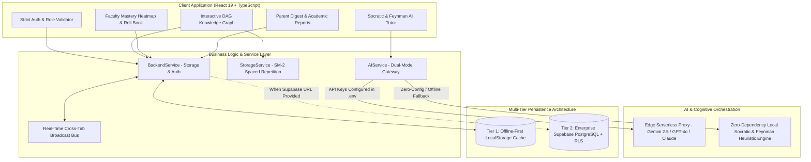
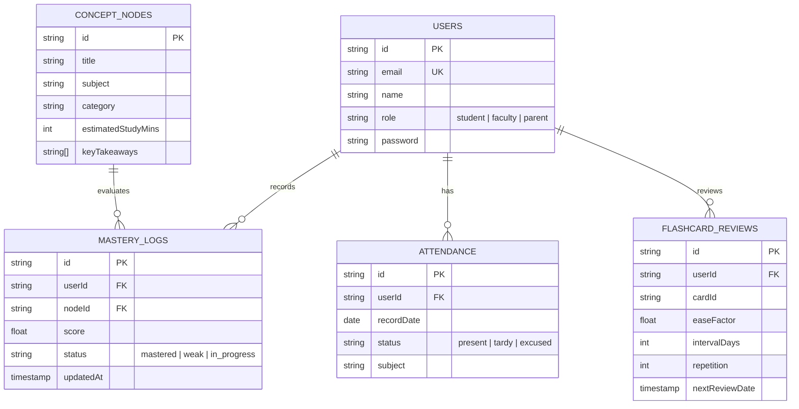

<!-- ========================================================= -->
<!-- 1. BANNER -->
<!-- ========================================================= -->

```
========================================================================================
                                WAYPOINT ACADEMIC SUITE
                   Student • Faculty • Parent Cognitive Learning Hub
========================================================================================
```

<p align="center">
  
</p>

<!-- ========================================================= -->
<!-- 2. TITLE & TAGLINE -->
<!-- ========================================================= -->

# 🎓 Waypoint — University Student & Faculty Portal

> **A tactile, cognitive learning platform that unifies academic operations, Socratic & Feynman AI tutoring, and curriculum knowledge graphs for students, educators, and families.**

<p align="center">
  <a href="https://edtech-fawn.vercel.app"></a>
  <a href="https://github.com/10-Mohan/edtech/actions/workflows/ci.yml"></a>
  <a href="https://vitest.dev/"></a>
  <a href="LICENSE"></a>
</p>

<p align="center">
  <a href="https://react.dev/"></a>
  <a href="https://www.typescriptlang.org/"></a>
  <a href="https://vitejs.dev/"></a>
  <a href="https://ai.google.dev/"></a>
  <a href="https://supabase.com/"></a>
</p>

---

<!-- ========================================================= -->
<!-- 3. ABOUT / DESCRIPTION -->
<!-- ========================================================= -->

## 📖 About

The **Waypoint University Student & Faculty Portal** is an open-access, cognitive learning platform engineered to replace rote memorization with deep conceptual mastery.

Structured around a paper-and-ink tactile notebook aesthetic, Waypoint brings together three core academic stakeholders:

- 👨‍🎓 **Students**: Explore curriculum prerequisite chains via interactive **Directed Acyclic Knowledge Graphs (DAGs)**, review concept flashcards with the **SuperMemo SM-2** spaced repetition algorithm, practice step-by-step with **Socratic AI**, and test their understanding using **Feynman "Teach-Back" AI evaluations**.
- 👩‍🏫 **Faculty (Teachers)**: Track cohort proficiency using a **Live Classroom Mastery Heatmap**, generate **3-Tier Differentiated Worksheets** (Tier 1 Scaffolded, Tier 2 Standard AP, Tier 3 Analytical Proofs) in one click, author curriculum nodes, and import student rosters.
- 👨‍👩‍👧 **Parents & Guardians**: Access plain-language weekly learning digests, view attendance logs, and explore conversation starters connecting classroom theory to real-world engineering.

---

<!-- ========================================================= -->
<!-- 4. LIVE DEMO & QUICK START -->
<!-- ========================================================= -->

## ⚡ Quick Start & Installation

### 🌐 Live Hosted Version
Evaluate the production deployment immediately: **[https://edtech-fawn.vercel.app](https://edtech-fawn.vercel.app)**

---

### 💻 Local Setup (Under 60 Seconds)

```bash
# 1. Clone the repository
git clone https://github.com/10-Mohan/edtech.git

# 2. Navigate to project directory
cd edtech

# 3. Install dependencies
npm install

# 4. (Optional) Configure environment variables
cp .env.example .env

# 5. Start the local Vite development server
npm run dev
```
Open **[http://localhost:5173](http://localhost:5173)** in your browser.

---

### 🔑 Demo Logins for Evaluation

| Role | Email | Password | Access Highlights |
|:---|:---|:---|:---|
| 👨‍🎓 **Student** | `maya.lin@oakwood.edu` | `student123` | Interactive DAG Graph, SM-2 Flashcards, Socratic AI & Feynman Tutor |
| 👩‍🏫 **Faculty (Teacher)** | `elena.vance@oakwood.edu` | `teacher123` | Classroom Mastery Heatmap, 3-Tier Worksheet Studio, Roster Import |
| 👨‍👩‍👧 **Parent / Guardian** | `elena.lin@family.org` | `parent123` | Weekly Growth Digest, Live Attendance, Dinner Table Starters |

---

<!-- ========================================================= -->
<!-- 5. SCREENSHOTS -->
<!-- ========================================================= -->

## 📷 Interface Previews

| 🔐 **Notebook Authentication** | 🧭 **Student Knowledge Graph (DAG)** |
|:---:|:---:|
| <a href="assets/screenshots/login.svg"></a> | <a href="assets/screenshots/student_graph.svg"></a> |
| *Strict credential check & tactile open-notebook UI* | *Interactive DAG prerequisite nodes & mastery scoring* |

| 👩‍🏫 **Faculty Mastery Heatmap** | 📝 **Differentiated Worksheet Studio** |
|:---:|:---:|
| <a href="assets/screenshots/faculty_portal.svg"></a> | <a href="assets/screenshots/worksheet_studio.svg"></a> |
| *Real-time cohort matrix & misconception radar* | *3-Tiered automated assignment generator (Scaffolded to Proof)* |

| 🤖 **Feynman "Teach-Back" AI** | 👨‍👩‍👧 **Parent Digest & Academic Report** |
|:---:|:---:|
| <a href="assets/screenshots/feynman_tutor.svg"></a> | <a href="assets/screenshots/parent_report.svg"></a> |
| *Cognitive evaluation of student-explained concepts* | *Plain-language weekly summary, conversation prompts & logs* |

---

<!-- ========================================================= -->
<!-- 6. SYSTEM ARCHITECTURE & PERSISTENCE -->
<!-- ========================================================= -->

## 🏛️ System & Persistence Architecture

Waypoint is architected with a **multi-tier hybrid persistence model** designed for zero-latency local operation and seamless enterprise cloud synchronization.



### 💾 Where Does Data Live? (Data Lifecycle)

| Persistence Tier | Technology | Purpose & Lifecycle |
|:---|:---|:---|
| **Tier 1: Local-First Cache** | `localStorage` + Memory Store | Instant zero-latency offline persistence for SM-2 repetition schedules, active recall intervals, mastery logs, and user sessions. Survives page reloads and browser restarts. |
| **Tier 2: Cross-Tab Event Bus** | `BroadcastChannel` Pub/Sub | Real-time cross-tab synchronization broadcasting node completions, mastery updates, and teacher interventions across open browser tabs. |
| **Tier 3: Enterprise Cloud DB** | Supabase PostgreSQL (`@supabase/supabase-js`) | Cloud persistence with full Row Level Security (RLS) policies (`supabaseService.ts`) for multi-device sync, school gradebooks, and collaborative faculty authoring. |

---

<!-- ========================================================= -->
<!-- 7. AI TUTOR WIRING & DUAL-MODE ENGINE -->
<!-- ========================================================= -->

## 🧠 AI Tutor Architecture & Dual-Mode Wiring

Waypoint features an **intelligent dual-engine architecture** ensuring that the Socratic and Feynman tutoring modules function seamlessly in all environments:

### 1. Live Cloud AI Mode (Serverless Edge Gateway)
- **Endpoints**: `/api/chat`, `/api/vision`, `/api/vector`
- **Supported Models**: Google Gemini 2.5 Flash / Pro, OpenAI GPT-4o, Anthropic Claude 3.5.
- **Multimodal Vision**: Analyzes handwritten mathematical derivations step-by-step, locating algebraic inversion and sign errors.
- **Activation**: Configure keys in `.env` (refer to `.env.example`).

### 2. Zero-Dependency Deterministic Heuristic Engine
- **In-Browser Fallback**: If no API keys are provided or if external cloud APIs experience rate limits, Waypoint automatically activates its built-in cognitive heuristic engine (`aiService.ts`).
- **Capabilities**: Conducts structured Socratic question ladders, checks boundary conditions, and applies Feynman pedagogical evaluation rubrics with precise scoring.
- **Demo-Ready Guarantee**: Ensures judges and evaluators experience interactive AI tutoring with zero friction or setup delays.

---

<!-- ========================================================= -->
<!-- 8. TESTING, VERIFICATION & CI/CD -->
<!-- ========================================================= -->

## 🧪 Testing, Mathematical Verification & CI/CD

Waypoint includes an automated test suite with **41 passing unit and integration tests** built on [Vitest](https://vitest.dev/).

```bash
# Run the complete test suite
npm test
```

### 📋 Test Coverage Highlights

| Test Suite | File | Verification Scope |
|:---|:---|:---|
| **SM-2 Algorithm Math** | `src/test/srsEngine.test.ts` | Validates SuperMemo SM-2 interval formulas, ease factor bounds ($EF \ge 1.3$), repetition resets, and overdue scheduling. |
| **AI Pedagogical Engine** | `src/test/aiEngine.test.ts` | Tests Socratic dialogue branching, Feynman rubric scoring, and response formatting. |
| **Safety & Guardrails** | `src/test/guardrailService.test.ts` | Verifies prompt injection prevention, safety heuristics, and content filtering. |
| **Backend & Auth Service** | `src/test/backendService.test.ts` | Tests credential authentication, role validation, node retrieval, and registration. |
| **PostgreSQL RLS Security** | `src/test/securityAndRateLimit.test.ts` | Validates Row Level Security schema rules and tenant isolation policies. |
| **Vector & Search Service** | `src/test/vectorService.test.ts` | Tests concept similarity scoring and semantic indexing. |

### 🚀 Continuous Integration (GitHub Actions)
Every commit and pull request to `main` triggers our automated CI pipeline ([`.github/workflows/ci.yml`](.github/workflows/ci.yml)), which validates:
1. **TypeScript Typecheck** (`tsc -b`)
2. **Vitest Unit & Integration Suite** (`npm test -- --run`)
3. **Production Rollup Build** (`npm run build`)

---

<!-- ========================================================= -->
<!-- 9. TECH STACK -->
<!-- ========================================================= -->

## 🚀 Tech Stack

### Frontend & UI
- ⚛️ **React 19** — Next-generation component state & hooks
- 🟦 **TypeScript 5.7** — Strict end-to-end type safety
- ⚡ **Vite 6** — Instant Hot Module Replacement (HMR) and optimized rollup bundle
- 🎨 **Notebook Design System** — Custom CSS design tokens with warm paper/ink palette & dark/light modes
- 🔣 **Lucide React** — Minimalist, clean iconography
- 📊 **Canvas Confetti & SVG DAG Renderers** — Interactive graph rendering and celebration effects

### AI & Cognitive Engines
- 🧠 **Google Gemini 2.5 (Flash & Pro)** — Dual-mode Socratic dialogue and multimodal homework vision reasoning
- 📉 **SuperMemo SM-2 Algorithm** — Spaced repetition mathematical scheduling
- 💡 **Offline Cognitive Heuristic Fallback** — In-browser Socratic fallback when running without an active API key

### Storage & Sync Architecture
- 💾 **Persistent Browser Storage (`localStorage`)** — Zero-configuration local database for accounts, nodes, and reviews
- 🐘 **Optional Supabase Cloud Connector (`PostgreSQL`)** — Cloud schema ready for team and multi-device sync

---

<!-- ========================================================= -->
<!-- 10. FOLDER STRUCTURE -->
<!-- ========================================================= -->

## 📁 Repository Structure

```
edtech/
├── 📁 .github/                    # GitHub Actions CI/CD workflows
│   └── 📁 workflows/
│       └── ci.yml                # Automated lint, typecheck, test, and build pipeline
├── 📁 api/                        # Serverless edge API handlers
│   ├── chat.ts                   # Socratic & Feynman AI dialogue handler
│   ├── health.ts                 # Real-time service uptime & diagnostic check
│   ├── vector.ts                 # Vector semantic search gateway
│   └── vision.ts                 # Multimodal homework derivation scanner
├── 📁 assets/                     # Vector graphics and interface previews
│   ├── banner.svg                # High-DPI repository banner
│   └── 📁 screenshots/           # UI diagrams for all portal views
├── 📁 src/                        # Core React frontend application
│   ├── 📁 components/
│   │   ├── 📁 auth/              # LoginPage, RegisterModal, role validation
│   │   ├── 📁 common/            # Header, Navigation, Modals, ThemeSelectors
│   │   ├── 📁 parent/            # ParentDashboard, Weekly Digests, Reports
│   │   ├── 📁 student/           # KnowledgeGraph, Flashcards, FeynmanTutor, HomeworkScanner
│   │   └── 📁 teacher/           # TeacherDashboard, MasteryHeatmap, WorksheetStudio
│   ├── 📁 data/                  # Pre-seeded concept graph & demo users
│   │   └── mockData.ts
│   ├── 📁 services/              # Business logic & API communication
│   │   ├── aiService.ts          # Gemini orchestration & fallback handling
│   │   ├── backendService.ts     # User authentication, nodes, & sync
│   │   ├── storageService.ts     # SM-2 cards, preferences, & metrics
│   │   ├── supabaseService.ts    # PostgreSQL cloud connector
│   │   └── vectorDbService.ts    # Qdrant semantic indexing
│   ├── 📁 test/                  # Automated Vitest unit & integration test suites
│   │   ├── aiEngine.test.ts
│   │   ├── backendService.test.ts
│   │   ├── curriculumAuthoring.test.ts
│   │   ├── curriculumGenerator.test.ts
│   │   ├── guardrailService.test.ts
│   │   ├── securityAndRateLimit.test.ts
│   │   ├── srsEngine.test.ts
│   │   ├── theme.test.ts
│   │   └── vectorService.test.ts
│   ├── 📁 types/                 # TypeScript interfaces and domain models
│   ├── App.tsx                   # Top-level state orchestration & routing
│   ├── main.tsx                  # React DOM mount point
│   └── index.css                 # Global notebook tokens & theme palette
├── .env.example                  # Environment variable template
├── LICENSE                       # MIT License
├── package.json                  # Dependencies and scripts
├── tsconfig.json                 # TypeScript compiler configuration
├── vercel.json                   # Serverless routing & deployment configuration
└── vite.config.ts                # Vite build configuration
```

---

<!-- ========================================================= -->
<!-- 11. API & SERVICE REFERENCE -->
<!-- ========================================================= -->

## 📡 API & Service Reference

### Core TypeScript Services

| Service | Method | Purpose |
|:---|:---|:---|
| **`BackendService`** | `authenticateWithPassword(email, pass, role)` | Strict verification against registered accounts |
| **`BackendService`** | `registerUserAccount(email, name, role, code, pass)` | Registers and persists a new user |
| **`BackendService`** | `getConceptNodes()` | Retrieves active DAG nodes |
| **`StorageService`** | `updateCardReview(cardId, quality)` | Runs SM-2 active recall scheduling |
| **`AIService`** | `explainConcept(prompt, mode)` | Sends request to Gemini 2.5 or local fallback |

### Edge Serverless Endpoints

| Method | Endpoint | Description |
|:---|:---|:---|
| `POST` | `/api/chat` | Conducts Socratic or Feynman dialogue |
| `POST` | `/api/vision` | Analyzes handwritten homework derivation |
| `POST` | `/api/vector` | Semantic search across concept embeddings |
| `GET` | `/api/health` | Service uptime & diagnostic check |

---

<!-- ========================================================= -->
<!-- 12. DATABASE SCHEMA -->
<!-- ========================================================= -->

## 🗄️ Data Model & Relationships



---

<!-- ========================================================= -->
<!-- 13. FUTURE SCOPE -->
<!-- ========================================================= -->

## 🚀 Future Scope & Roadmap

- [ ] 📱 **Cross-Platform Mobile App**: React Native / Expo companion app for iOS and Android.
- [ ] 🎙️ **Real-Time Voice Socratic AI**: Low-latency spoken conversational tutoring using WebSockets / WebRTC.
- [ ] 👤 **Facial Recognition Roll Call**: Edge webcam attendance logging.
- [ ] 🔗 **LMS & Canvas LTI 1.3 Integration**: Direct Gradebook and Roster sync for schools.
- [ ] 💳 **Integrated Academic Billing**: Tuition & lab fee payments via Stripe.

---

<!-- ========================================================= -->
<!-- 14. CONTRIBUTORS -->
<!-- ========================================================= -->

## 👨‍💻 Contributors

- **Mohan S** — Lead Developer & Architect — [@10-Mohan](https://github.com/10-Mohan)

---

<!-- ========================================================= -->
<!-- 15. LICENSE -->
<!-- ========================================================= -->

## 📄 License

This project is licensed under the **MIT License** — see the [LICENSE](LICENSE) file for details.
